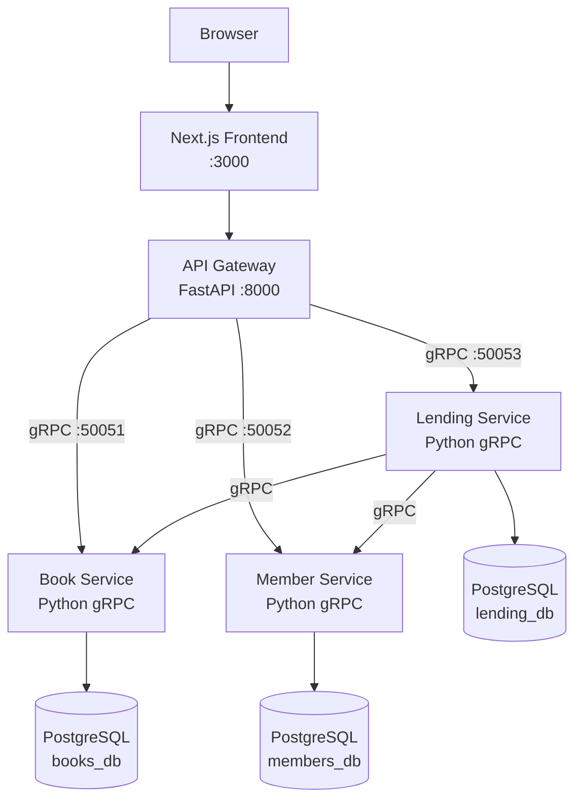
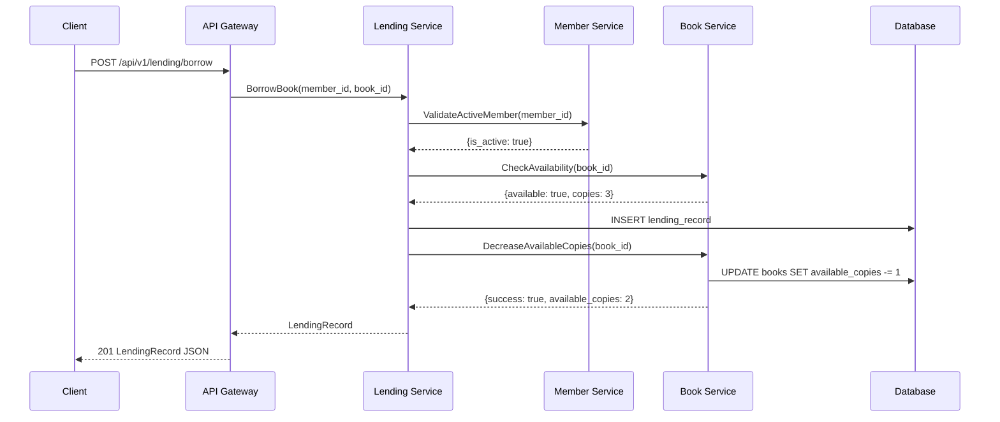
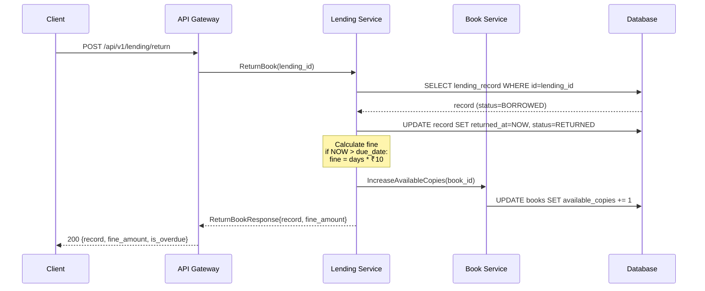
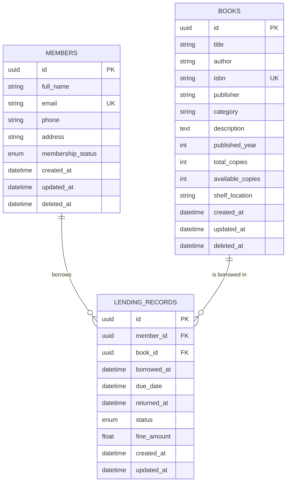

# 🏛️ Library Management System

A production-ready, enterprise-grade **Library Management System** built with a microservices architecture. Manages books, members, and borrowing operations across dedicated services communicating via gRPC.

---

## 📋 Table of Contents

- [Overview](#overview)
- [Architecture](#architecture)
- [Technology Stack](#technology-stack)
- [Project Structure](#project-structure)
- [Quick Start](#quick-start)
- [Docker Setup](#docker-setup)
- [Kubernetes Setup](#kubernetes-setup)
- [Proto Generation](#proto-generation)
- [Database Setup](#database-setup)
- [Testing](#testing)
- [API Reference](#api-reference)
- [Diagrams](#diagrams)
- [Troubleshooting](#troubleshooting)
- [Future Improvements](#future-improvements)
- [Assumptions](#assumptions)
- [Evaluation Checklist](#evaluation-checklist)

---

## Overview

The Library Management System manages the complete lifecycle of:

- **Books** — catalogue management, search, availability tracking
- **Members** — registration, activation, membership management  
- **Borrowing** — issue books, return books, fine calculation (₹10/day overdue)

### Key Design Decisions

### Microservices by Domain

The system is split into three domain services:

- Book Service
- Member Service
- Lending Service

Each service owns its own data model, database schema, and gRPC contract. This keeps domain logic isolated, improves maintainability, and allows each service to evolve independently.

### REST API Gateway + Internal gRPC

The frontend communicates with a single FastAPI API Gateway over REST.

Internally, the API Gateway communicates with backend services using gRPC and Protocol Buffers.

This provides:

- Simple browser-friendly REST APIs for the frontend
- Strongly typed service-to-service contracts
- Clear service boundaries
- Better performance for internal communication

### Async-first Python

All backend services use async Python with:

- asyncio
- grpc.aio
- asyncpg
- SQLAlchemy async support

This keeps the services lightweight and improves concurrency for I/O-heavy operations such as database calls and service-to-service communication.

### PostgreSQL Schema Isolation

For local development simplicity, the system uses a single PostgreSQL instance with three logical schemas:

- books_db
- members_db
- lending_db

This simulates service-owned databases while keeping Docker Compose setup simple.

In a production deployment, these schemas can be migrated to separate PostgreSQL databases without changing the service boundaries.

### Lending Consistency

Borrow and return workflows are coordinated by the Lending Service.

The Lending Service validates members through Member Service and updates inventory through Book Service using gRPC.

For failure scenarios, the design follows a simple Saga-style approach with compensation where needed, such as restoring book availability if lending creation fails after inventory reservation.

### Container-first Deployment

The project is designed to run consistently using Docker Compose locally and Kubernetes manifests for cluster deployment.

Each service has its own Dockerfile, health check, configuration, and resource limits.

### Observability and Monitoring

The platform includes foundational observability capabilities to support troubleshooting, monitoring, and operational visibility.

#### Structured JSON Logging

All services emit structured JSON logs instead of plain text logs.

Each log entry includes:

- timestamp
- service_name
- log_level
- correlation_id
- request_id
- operation
- message

Example:

```json
{
  "timestamp": "2026-06-12T10:15:23Z",
  "service": "lending-service",
  "level": "INFO",
  "correlation_id": "c7a8d3f2",
  "operation": "borrow_book",
  "member_id": 101,
  "book_id": 55,
  "message": "Book borrowed successfully"
}
```
---

## Architecture

```
┌──────────────────────────────────────────────────────────┐
│                      Browser / Mobile                     │
└──────────────────────┬───────────────────────────────────┘
                       │ HTTP/REST
┌──────────────────────▼───────────────────────────────────┐
│             Next.js Frontend (port 3000)                  │
│         TypeScript · TailwindCSS · React Query            │
└──────────────────────┬───────────────────────────────────┘
                       │ HTTP/REST
┌──────────────────────▼───────────────────────────────────┐
│             API Gateway / FastAPI (port 8000)             │
│    REST endpoints · Validation · gRPC client · CORS       │
└────────┬─────────────┬──────────────┬────────────────────┘
         │ gRPC        │ gRPC         │ gRPC
   ┌─────▼──────┐ ┌────▼───────┐ ┌───▼──────────┐
   │Book Service│ │Mbr Service │ │Lend Service  │
   │ port 50051 │ │ port 50052 │ │  port 50053  │
   │            │ │            │ │(calls Book + │
   │  books_db  │ │ members_db │ │  Member svc) │
   └─────┬──────┘ └────┬───────┘ └───┬──────────┘
         │             │             │  lending_db
         └─────────────┴─────────────┘
                       │
            ┌──────────▼──────────┐
            │  PostgreSQL (5432)  │
            │  books_db schema    │
            │  members_db schema  │
            │  lending_db schema  │
            └─────────────────────┘
```

---

## Technology Stack

| Layer         | Technology                                   |
|---------------|----------------------------------------------|
| Frontend      | Next.js 14, TypeScript, TailwindCSS, React Query |
| API Gateway   | Python 3.11, FastAPI, uvicorn                |
| gRPC Services | Python 3.11, grpc.aio                        |
| Serialization | Protocol Buffers 3                           |
| ORM           | SQLAlchemy 2.x (async)                       |
| Database      | PostgreSQL 15                                |
| Migrations    | Alembic                                      |
| Containers    | Docker, Docker Compose                       |
| Orchestration | Kubernetes (manifests included)              |
| Testing       | pytest, pytest-asyncio                       |
| CI/CD         | GitHub Actions                               |

---

## Project Structure

```
library-management-system/
├── Makefile                          # All dev commands
├── docker-compose.yml                # Full stack orchestration
├── .env.example                      # Environment template
├── proto/
│   ├── common.proto                  # Shared pagination/status messages
│   ├── book.proto                    # Book service contracts
│   ├── member.proto                  # Member service contracts
│   └── lending.proto                 # Lending service contracts
├── services/
│   ├── api-gateway/                  # FastAPI REST gateway
│   │   ├── app/
│   │   │   ├── main.py               # FastAPI app, health, dashboard
│   │   │   ├── routers/              # books.py, members.py, lending.py
│   │   │   ├── schemas/              # Pydantic request/response models
│   │   │   ├── grpc_clients/         # Channel factories + proto stubs
│   │   │   └── middleware/           # Correlation ID + request logging
│   │   ├── tests/
│   │   └── Dockerfile
│   ├── book-service/                 # gRPC Book microservice
│   │   ├── app/
│   │   │   ├── models/book.py        # SQLAlchemy Book model
│   │   │   ├── repositories/         # BookRepository (async CRUD)
│   │   │   ├── grpc_handlers/        # BookServiceHandler
│   │   │   └── database.py           # Async engine + session
│   │   ├── main.py                   # gRPC server entry point
│   │   ├── tests/
│   │   └── Dockerfile
│   ├── member-service/               # gRPC Member microservice
│   ├── lending-service/              # gRPC Lending microservice
│   └── frontend/                     # Next.js application
│       └── src/
│           ├── app/                  # Next.js 14 App Router pages
│           ├── components/           # Reusable UI + form components
│           ├── lib/                  # API client, utilities
│           └── types/                # TypeScript type definitions
├── infrastructure/
│   └── k8s/                          # Kubernetes manifests
│       ├── namespace.yaml
│       ├── configmap.yaml
│       ├── secret.yaml
│       ├── postgres-deployment.yaml
│       ├── book-service-deployment.yaml
│       ├── member-service-deployment.yaml
│       ├── lending-service-deployment.yaml
│       ├── api-gateway-deployment.yaml
│       ├── frontend-deployment.yaml
│       ├── ingress.yaml
│       ├── hpa.yaml
│       └── network-policy.yaml
├── scripts/
│   ├── generate_proto.sh             # Proto compilation script
│   ├── init_db.sql                   # Schema initialization
│   ├── sample_rest_client.py         # Demo REST client
│   └── sample_grpc_client.py         # Demo gRPC client
├── docs/
│   ├── postman_collection.json       # Import into Postman
│   └── curl_examples.sh              # cURL reference
└── .github/workflows/ci.yml          # GitHub Actions pipeline
```

---

## Quick Start

### Prerequisites

- Docker & Docker Compose
- Make (optional but recommended)
- Python 3.11+ (for local dev / proto generation)
- Node.js 20+ (for local frontend dev)

### 1. Clone and configure

```bash
git clone <repo-url>
cd library-management-system
cp .env.example .env
```

### 2. Start everything

```bash
# Single command to build and start all services
make up
# OR
docker compose up --build -d
```

### 3. Access services

| Service     | URL                              |
|-------------|----------------------------------|
| Frontend    | http://localhost:3000            |
| API Gateway | http://localhost:8000            |
| API Docs    | http://localhost:8000/docs       |
| Health      | http://localhost:8000/health     |
| pgAdmin     | Connect to localhost:5432        |

### 4. Run the sample client

```bash
# REST client demo (full end-to-end walkthrough)
make sample-client
# OR
python scripts/sample_rest_client.py
```

---

## Docker Setup

### Build images individually

```bash
docker compose build book-service
docker compose build member-service
docker compose build lending-service
docker compose build api-gateway
docker compose build frontend
```

### Follow logs

```bash
make logs             # all services
make logs-api-gateway # single service
docker compose logs -f book-service
```

### Restart a service

```bash
make restart-book-service
```

### Stop and clean up

```bash
make down             # stop containers
make clean            # stop + remove volumes + generated protos
```

---

## Kubernetes Setup

### Prerequisites

- kubectl configured against a cluster (minikube, kind, k3s, or managed)
- Images pushed to a registry or using local images

### Deploy

```bash
# Apply all manifests in order
make k8s-apply

# Check status
make k8s-status
kubectl get pods -n library-system
kubectl get services -n library-system
kubectl get ingress -n library-system
```

### Update /etc/hosts for local ingress

```
127.0.0.1  library.local
127.0.0.1  api.library.local
```

Then access:
- Frontend: http://library.local
- API: http://api.library.local/docs

### Scale services

```bash
kubectl scale deployment api-gateway --replicas=3 -n library-system
kubectl scale deployment book-service --replicas=4 -n library-system
```

### Tear down

```bash
make k8s-delete
```

---

## Proto Generation

Protocol Buffer stubs are generated at Docker build time via each service's Dockerfile.
For local development:

```bash
# Install tools
make proto-install
# OR
pip install grpcio-tools protobuf

# Generate stubs for all services
make proto
# OR
bash scripts/generate_proto.sh
```

Stubs are written to:
- `services/book-service/app/proto_generated/`
- `services/member-service/app/proto_generated/`
- `services/lending-service/app/proto_generated/`
- `services/api-gateway/app/grpc_clients/proto_generated/`

---

## Database Setup

The PostgreSQL instance uses three schemas for logical service isolation:

| Schema       | Owned by       | Tables           |
|--------------|----------------|------------------|
| `books_db`   | Book Service   | `books`          |
| `members_db` | Member Service | `members`        |
| `lending_db` | Lending Service| `lending_records`|

### Schema initialization

The `scripts/init_db.sql` runs automatically via Docker entrypoint and creates the schemas.
Each service creates its own tables on startup via SQLAlchemy's `create_all`.

### Connect directly

```bash
make db-shell
# OR
docker compose exec postgres psql -U library -d librarydb
```

### Useful queries

```sql
-- See all tables
\dt books_db.*
\dt members_db.*
\dt lending_db.*

-- Count books
SELECT COUNT(*) FROM books_db.books WHERE deleted_at IS NULL;

-- Overdue records
SELECT * FROM lending_db.lending_records
WHERE status = 'OVERDUE' ORDER BY due_date;

-- Fine summary
SELECT member_id, SUM(fine_amount) as total_fine
FROM lending_db.lending_records
WHERE fine_amount > 0
GROUP BY member_id;
```

---

## Testing

### Run all tests

```bash
make test
```

### Run tests for a specific service

```bash
make test-book-service
make test-member-service
make test-lending-service
```

### Test coverage areas

| Service         | Test File                              | Coverage                                      |
|-----------------|----------------------------------------|-----------------------------------------------|
| Book Service    | `tests/test_book_repository.py`        | CRUD, availability, soft delete, pagination   |
| Member Service  | `tests/test_member_repository.py`      | CRUD, deactivation, default status            |
| Lending Service | `tests/test_lending.py`                | Borrow, return, fine calculation, overdue     |
| API Gateway     | `tests/test_schemas.py`                | Pydantic validation, field constraints        |

### Fine calculation verification

```python
# Tests verify the ₹10/day rule:
# 5 days overdue  → fine = ₹50
# 1 day overdue   → fine = ₹10
# 30 days overdue → fine = ₹300
# On-time return  → fine = ₹0
```

---

## API Reference

### Base URL: `http://localhost:8000`

#### Health

```
GET  /health                  Service health check
GET  /api/v1/dashboard        Aggregate stats
```

#### Books

```
POST   /api/v1/books              Create book
GET    /api/v1/books              List books (paginated)
GET    /api/v1/books/search       Search by title/author/category/isbn
GET    /api/v1/books/{id}         Get book
PUT    /api/v1/books/{id}         Update book
DELETE /api/v1/books/{id}         Soft delete book
```

#### Members

```
POST   /api/v1/members            Register member
GET    /api/v1/members            List members (paginated)
GET    /api/v1/members/{id}       Get member
PUT    /api/v1/members/{id}       Update member
DELETE /api/v1/members/{id}       Deactivate member
```

#### Lending

```
POST /api/v1/lending/borrow                 Borrow a book
POST /api/v1/lending/return                 Return a book
GET  /api/v1/lending/borrowed               All currently borrowed
GET  /api/v1/lending/member/{memberId}      Borrowed by member
GET  /api/v1/lending/book/{bookId}/history  Book borrow history
GET  /api/v1/lending/overdue                All overdue records
```

Interactive docs: **http://localhost:8000/docs**

---

## Diagrams

### High-Level Architecture



### Borrow Book Sequence



### Return Book Sequence



### ER Diagram



---

## Troubleshooting

### Services won't start

```bash
# Check logs
docker compose logs book-service
docker compose logs postgres

# Verify postgres is healthy before services
docker compose ps
# postgres should show "(healthy)" before other services start
```

### Proto import errors

```bash
# Regenerate proto stubs inside containers
make down && make up
# OR regenerate locally
make proto-install && make proto
```

### gRPC connection refused

```bash
# Check service health
curl http://localhost:8000/health

# Check service ports are exposed
docker compose ps
# book-service should show 0.0.0.0:50051->50051/tcp
```

### Database connection errors

```bash
# Check postgres is running
docker compose exec postgres pg_isready -U library

# Check schemas exist
docker compose exec postgres psql -U library -d librarydb -c "\dn"
```

### Frontend API connection

The frontend reads `NEXT_PUBLIC_API_URL` at build time. If the API gateway is on a different URL, rebuild the frontend image with the correct env var:

```bash
NEXT_PUBLIC_API_URL=http://your-api-host:8000 docker compose build frontend
```

---

## Future Improvements

1. **Authentication & Authorization** — JWT-based auth with role-based access (Admin, Librarian, Member)
2. **Alembic migrations** — Proper versioned schema migrations instead of `create_all`
3. **Event streaming** — Kafka/Redis Streams for inter-service events (e.g., fine notifications)
4. **Notification service** — Email/SMS alerts for due date reminders and overdue notices
5. **Advanced search** — Full-text search with PostgreSQL FTS or Elasticsearch
6. **gRPC-Web** — Allow browser clients to call gRPC directly via Envoy proxy
7. **Observability** — OpenTelemetry traces, Prometheus metrics, Grafana dashboards
8. **Rate limiting** — Per-IP and per-user rate limiting in API Gateway
9. **Caching** — Redis cache for frequently read book/member data
10. **Book reservations** — Allow members to reserve books that are currently unavailable
11. **Renewal flow** — Extend due date for borrowed books
12. **CSV/PDF reports** — Export overdue lists, member activity, inventory reports
13. **Multi-tenant** — Support for multiple library branches

---

## Assumptions

1. **Single PostgreSQL instance** for interview simplicity; production would use separate databases per service
2. **No authentication** in this version; JWT scaffolding is present in requirements but not wired
3. **gRPC over insecure channels** (no TLS); production would use mTLS
4. **Fine calculation** uses UTC timestamps; timezone handling would be added in production
5. **Available copies** cannot exceed `total_copies` (enforced at repository level)
6. **Member deactivation** preserves all historical lending records
7. **Soft delete** for books preserves historical lending records referencing them
8. **Due days default** is 14 days; configurable per borrow request (1–365 days)
9. The `NEXT_PUBLIC_API_URL` environment variable must be set at **build time** for Next.js (static optimization)

---

## Evaluation Checklist

| Requirement                    | Status | Details                                                          |
|-------------------------------|--------|------------------------------------------------------------------|
| ✅ Database schema             | Done   | Books, Members, Lending — normalized with PKs, FKs, indexes, soft deletes |
| ✅ REST API                    | Done   | All 16 endpoints implemented in FastAPI API Gateway              |
| ✅ gRPC                        | Done   | 19 RPCs across 3 services; full .proto contracts                 |
| ✅ PostgreSQL                  | Done   | PostgreSQL 15 with 3 logical schemas                             |
| ✅ Python 3.11+                | Done   | All backend services in Python 3.11                              |
| ✅ Frontend                    | Done   | Next.js 14 + TypeScript + TailwindCSS — all pages implemented    |
| ✅ Docker                      | Done   | Dockerfile per service + docker-compose.yml — single `make up`  |
| ✅ Kubernetes                  | Done   | 13 manifests: namespace, configmap, secret, deployments, services, ingress, HPA, NetworkPolicy |
| ✅ Documentation               | Done   | README, curl examples, Postman collection, inline code comments  |
| ✅ Error handling              | Done   | gRPC status codes → HTTP codes, Pydantic validation, try/catch   |
| ✅ Testing                     | Done   | pytest unit tests for all services; fine calculation verified    |
| ✅ Production readiness        | Done   | Structured logging, correlation IDs, health checks, pagination, graceful shutdown, resource limits |
